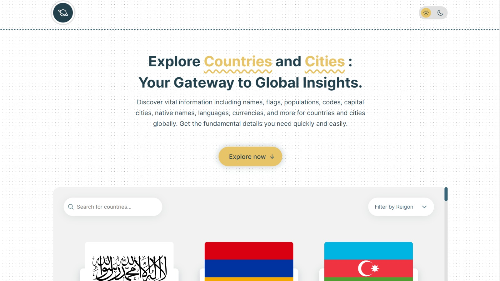
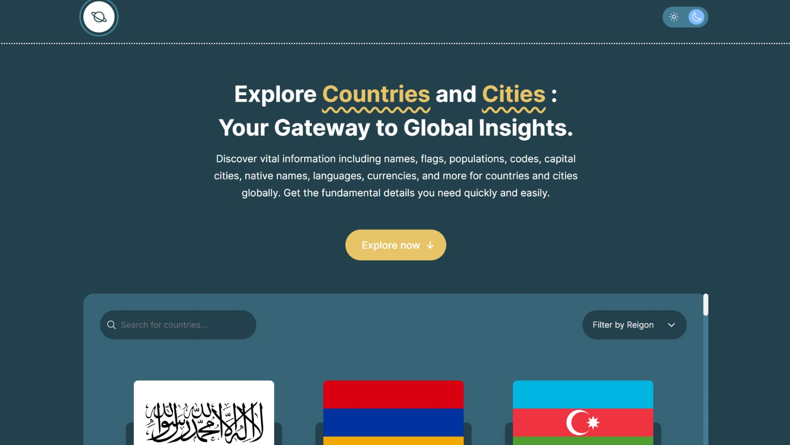

# Rest Countries API with Color Theme Switcher (Frontend Mentor Challenge Solution)

This project is an enhanced solution of the 'rest-countries-api-with-color-theme-switcher' challenge from Frontend Mentor. It leverages the Rest Countries API to showcase comprehensive information about various countries, while also featuring a color theme switcher for toggling between light and dark modes.

## Features

- Display information about various countries including name, population, region, capital, native name, top-level domain, currencies, languages, borders, states, cities, and Google Maps link.
- Color theme switcher to toggle between light and dark modes.
- Search functionality to filter countries by name.
- Filter countries by region.
- Sort countries by population in ascending or descending order.

## Technologies Used

- HTML
- CSS (SASS)
- JavaScript
- Vite (for project setup and development)

## Installation

1. Clone the repository: `git clone https://github.com/Sandy-SandBox/rest-countries`
2. Navigate to the project directory: `cd your-repository`
3. Install dependencies: `npm install`
4. Start the development server: `npm run dev`
5. Open your web browser and navigate to `http://localhost:3000` to view the application.

## Usage

- Upon loading the application, you will see a list of countries displayed with their basic information.
- Use the search bar to filter countries by name.
- Use the filter dropdown to filter countries by region.
- Click on the "Details" button of a country to view more detailed information including states, cities, and Google Maps link.
- Toggle between light and dark modes using the theme switcher button.
- Sort countries by population by clicking on the "Sort by highest population" or "Sort by lowest population" button.

## Screenshots

Live Preview: [Link to Live Preview](https://your-project-live-url.com)

## Credits

- [Frontend Mentor](https://www.frontendmentor.io/) for providing the challenge.
- Rest Countries API for providing country data.
